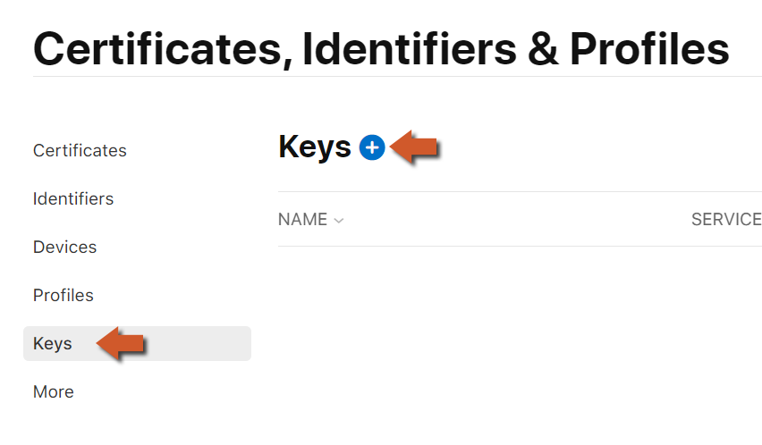
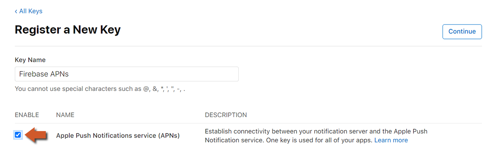
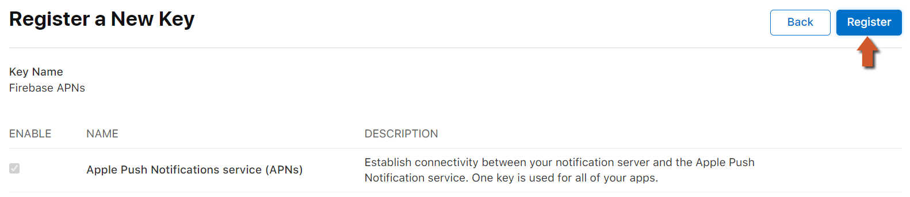

@title Cloud Messaging Guides

<!-- Page HTML do not touch -->
<a />
[Back To Top](#top)

# Platform Setup

  Firebase Cloud Messaging implementation uses SDK dependencies and therefore is only available on **Android** and **iOS** targets. In this section we will cover the required setup necessary to start using the Cloud Messaging extension on your game.
  Select your target platform below and follow the simple steps to get your project up and running (you only need follow this setup once per project):

* ${page.Platform_Setup#Android_Setup}
* ${page.Platform_Setup#iOS_Setup}

## Additional steps for iOS

  On iOS you will need to retrieve a P8 certificate and upload it to your Firebase project to enable sending push notifications through APNs:

* Head to the [Apple Developer](https://developer.apple.com/account) site and select &quot; **Certificates, Identifiers &amp; Profiles** &quot;. 
      

* Select &quot; **Keys** &quot; from the menu on the left, and create a new key by clicking on the plus sign. 
      

* Enter a **name** for the key, enable **Apple Push Notifications service** (APNs) and click on **Continue** . 
      

* On the next page, confirm the key details and click on **Register** . 
      

* **Note** the information given here (key ID) and **download** the key as you will not be able to see this screen again. 
      

* Go to the dashboard for your Firebase project and open the **Project Settings** . Here, open the **Cloud Messaging** tab. 
      

* Select your iOS application, and under &quot; **APNs Authentication Key** &quot;, press **Upload** to upload your key. 
      

* Here, upload your P8 file and enter the other required details that you retrieved from the Apple Developer site. 
      

  You can now send notifications to the iOS client game by going under **&quot;Engage&quot;** and selecting **&quot;Cloud Messaging&quot;** on your Firebase dashboard. 
  

  

---