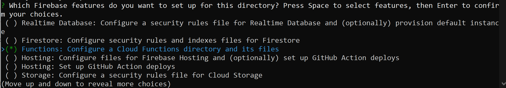
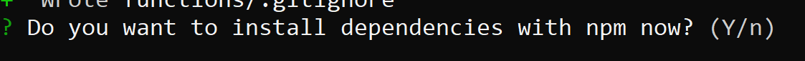
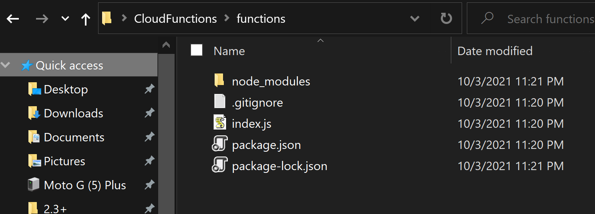
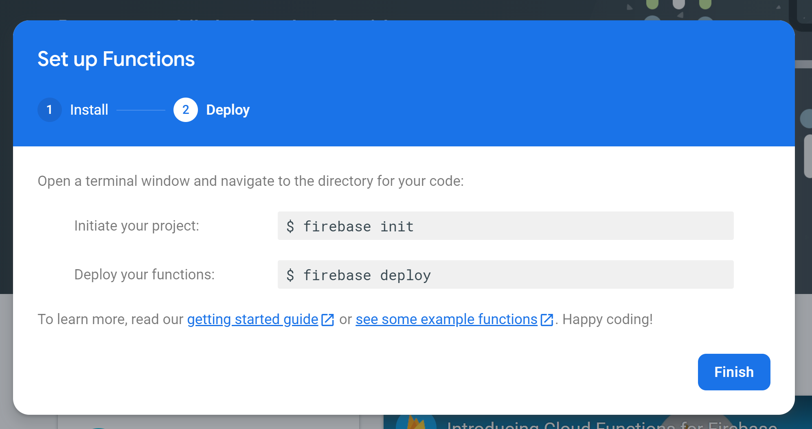

@title Cloud Functions Setup

<!-- Page HTML do not touch -->
<a />
[Back To Top](#top)

# Create and Deploy

  Firebase Cloud Functions have very little to do with GML itself and more with programming server-side functions in JavaScript (or TypeScript). This guide will get you going with creating your first function and deploying it to the Firebase Cloud Functions server.

1. We'll move to the folder where we want work using the `cd $Path` command (this will change the path you're working in): 
      

2. We now need to call the ** `firebase init` command: 
      

3. You will be asked &quot; **Are you ready to proceed?** &quot;, where your response should be **Y** (yes).
4. Now use the arrow keys to navigate the list and select **Functions**  **with the Space** key; after that, press the **Enter** key to continue. 
      

5. At this point we recommend using an existing Firebase project (as this will make configuration easier). 
      

6. Now enter your **Project ID** , which you can get under **Project Settings** in the [Firebase Console](https://console.firebase.google.com/) for your project. 
      

7. Choose **JavaScript** (for the purpose of this tutorial). 
      

8. Choose **N** (unless you are experienced with JS and wish to use ESLint). 
      

9. Finally select **Y** (for installing dependencies). 
      

10. After the process is over, you can see that your folder now has the following structure: 
      

11. Inside the **functions** folder we can see a **`index.js`** file, which is where we will be declaring our functions. 
      

12. In the `index.js` file you will see the following code, which creates a function called **helloWorld** and initialises its code. 
      

> **:information_source: NOTE**
>
> We can see that we are exporting a `helloWorld` function that registers to an `onRequest` event with the arguments `request` and `response`; these correspond to the &quot;message sent by the client&quot; (GameMaker) and the &quot;message we will send back&quot;, respectively.

13. Deploy it with `firebase deploy` command.
14. When the deploy process is done, you will see the &quot; **Deploy complete&quot;** message. 
      

15. After deploying has finished, you will see the function on the Firebase Console in the **Functions** tab: 
      

16. This way you are able to publish your own functions to the Firebase Cloud Functions.

  

---

<!-- Page HTML do not touch -->
<a />
[Back To Top](#top)

# Firebase Console

  This guide covers setting up and enabling Cloud Functions from inside the [Firebase Console](https://console.firebase.google.com/).

1. Head over to the **Functions** section, ** however to use this you will need to have upgraded your project to Blaze (pay as you go). 
      

2. After upgrading the project you will see an **Instructions** button that you need to click on: 
      

3. The first instruction is to use `npm install -g firebase-tools` in the command line (you will need to install [NodeJS](https://nodejs.org/) for this). 
      

4. After some loading you need to click on Continue, after which you will see the following page: 
      

5. We are done configuring the Firebase Console. We can now continue to ${page.setup_cloud_functions#Create_and_Deploy}.

  

---