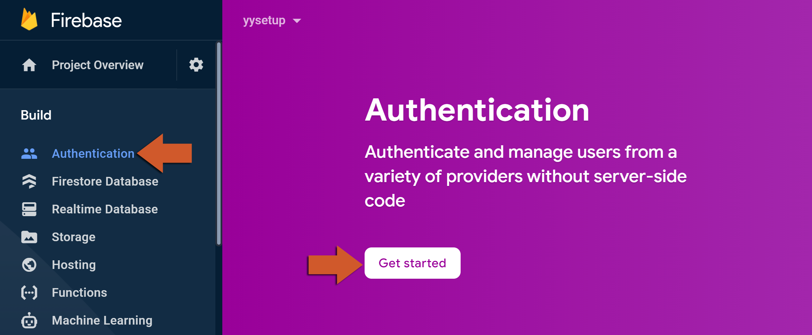
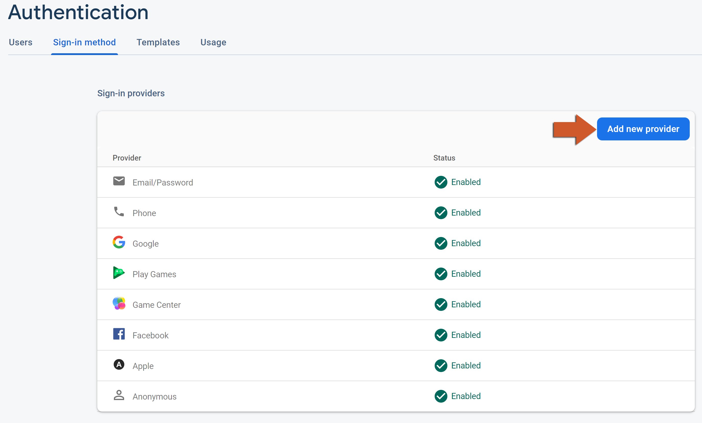

@title Authentication Guide

# Authentication Guide

This page is the console side of Firebase Authentication: turning the product on, enabling the
sign-in methods your game uses, and what each of them needs from you before it works. The GML side
is on the ${module.auth} page.

# Enabling sign-in methods

1. In the [Firebase console](https://console.firebase.google.com/), open **Build > Authentication**
   and click **Get started**. 
   

2. On the **Sign-in method** tab, click **Add new provider** and enable each method your game
   offers. A method that is not enabled here fails in the game with
   `FirebaseAuthError.OperationNotAllowed`. 
   

3. The **Users** tab lists every account created from then on, with its sign-in methods and
   identifier; it is where you delete a test account or disable a player.

# What each method needs

- **Email/Password** and **Anonymous** need nothing beyond being enabled. The e-mails the
  service sends - password reset, address verification - are edited under **Templates**.
- **Phone** needs nothing in the console to enable, but the SDK verifies that the request comes
  from a real app before sending an SMS: on Android through Play Integrity, on iOS through a silent
  push notification, which needs the APNs key described on ${page.guides_cloud_messaging}. For
  development, add **Phone numbers for testing** under the provider's settings: those numbers
  sign in with the code you enter there, without an SMS.
- **Google** and **Play Games** need the SHA-1 of every keystore that signs the game on the Android
  app registration (${page.platform_setup}); the console creates the OAuth clients from it, and a
  build signed with a keystore whose SHA-1 is missing is refused. Play Games additionally needs
  the game set up in the Google Play Console and linked to the Firebase project.
- **Apple** needs the Sign in with Apple capability on the App ID in the Apple developer portal;
  on iOS that is all, and the sign-in runs through
  ${function.firebase_auth_sign_in_with_provider}. On Android the provider's settings also need a
  **Services ID**, a **Team ID**, a **Key ID** and the private key from the developer portal, so that
  the web flow can complete.
- **Game Center** needs nothing beyond being enabled; the credential comes from
  ${function.firebase_auth_game_center_auth_provider_get_credential} on iOS.
- **Facebook**, **Microsoft**, **Yahoo**, **GitHub** and **Twitter** each ask for the app id (or
  client id) and secret of an app registered with that provider, and show the OAuth redirect URL
  to enter on the provider's side. The token for Facebook comes from the Facebook extension's
  sign-in flow; the others run through ${function.firebase_auth_sign_in_with_provider}.

# Settings worth checking

- **Settings > User actions**: whether one account may hold several sign-in methods with
  different e-mail addresses, and whether new sign-ups are allowed at all - useful to close the
  door once a game is live.
- **Settings > Authorized domains** only matters for web flows; the extension's provider sign-ins
  use the Firebase-hosted domain the console lists there already.
- Firebase persists the sign-in on the device, so a player stays signed in across launches;
  ${function.firebase_auth_add_state_listener} is how the game finds out who is signed in when it
  starts.
