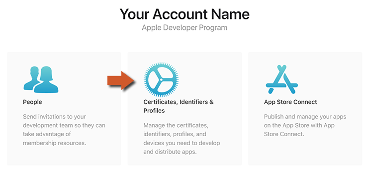
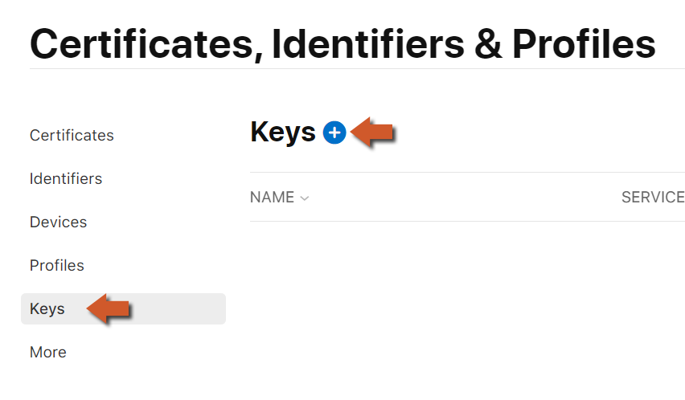
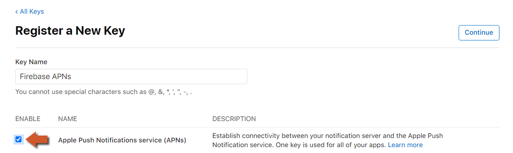
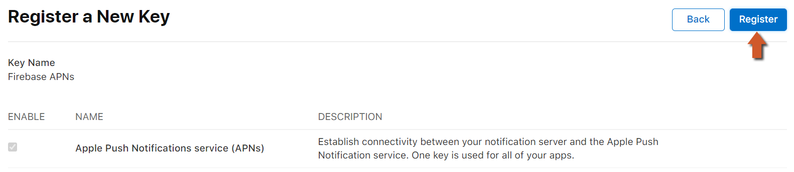
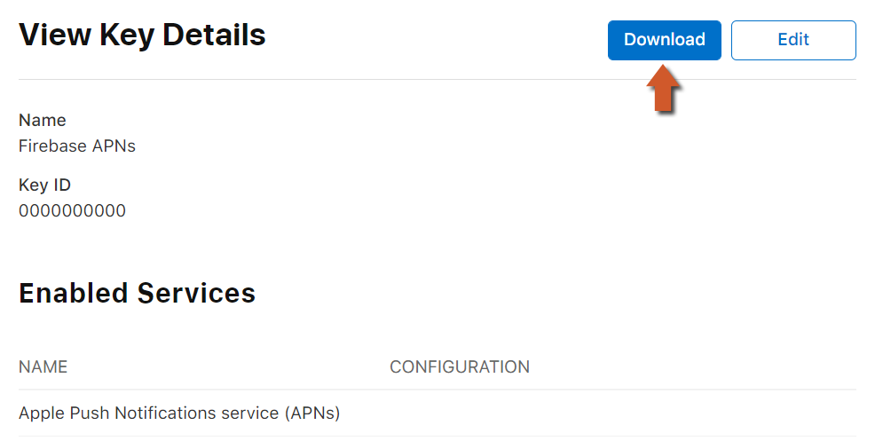
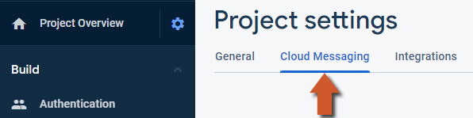
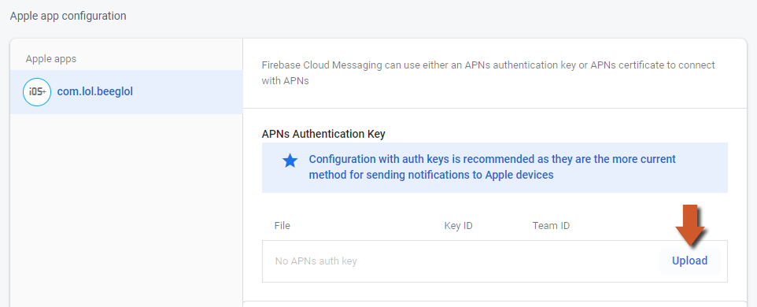
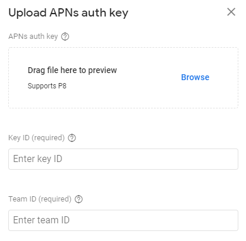
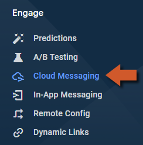

@title Cloud Messaging Guide

# Cloud Messaging Guide

This page is the console side of Cloud Messaging: the APNs key iOS needs before a single push can
be delivered, and sending your first messages from the console. The GML side - initialising,
receiving, topics, consent - is on the ${module.messaging} page. Android needs nothing beyond the
credential file from ${page.platform_setup}.

# iOS: the APNs key

Apple delivers push notifications through its own service, APNs, and Firebase can only hand
messages to it with a key from your developer account. Once per project:

1. On the [Apple Developer](https://developer.apple.com/account) site, open **Certificates,
   Identifiers & Profiles**. 
   

2. Select **Keys** in the menu on the left and click the plus sign to create a key. 
   

3. Give the key a name, enable **Apple Push Notifications service (APNs)** and click
   **Continue**. 
   

4. Confirm the details and click **Register**. 
   

5. Note the **Key ID** and **download** the `.p8` file - this screen is shown once, and the file
   cannot be downloaded again. Your **Team ID** is at the top right of the developer site. 
   

6. In the [Firebase console](https://console.firebase.google.com/), open **Project settings** and
   the **Cloud Messaging** tab. 
   

7. Under **Apple app configuration**, select your iOS app and click **Upload** next to **APNs
   Authentication Key**. 
   

8. Upload the `.p8` file and enter the Key ID and Team ID. 
   

The App ID the game is signed with also needs the **Push Notifications** capability in the
developer portal, and the exported Xcode project the matching capability under **Signing &
Capabilities** - check it is there before archiving, or APNs registration fails in the game with
`FailedToRegisterForRemoteNotifications` (code `1`). Push notifications do not work on the iOS
simulator; test on a device.

# Sending a test message

Messages are sent from **Engage > Messaging** in the console, and the quickest check that
everything is wired up is a test message to your own device:

1. Run the game on the device with ${function.firebase_messaging_initialize} called, and get the
   device's registration token: the test dialog addresses a device by that token, which is the
   one place the token API the SDK has otherwise superseded is still needed -
   ${function.firebase_messaging_get_token} delivers it to a callback. Print it with
   `show_debug_message` and copy it from the output.
2. In the console, click **Create your first campaign** (or **New campaign**), choose **Firebase
   Notification messages**, write a title and text, and click **Send test message**.
3. Paste the token, add it, and click **Test**. The notification appears on the device within
   seconds - shown by the system when the game is in the background, delivered to
   ${function.firebase_messaging_poll_message} with nothing shown when it is in the
   foreground. 
   

A campaign proper is the same dialog without the test step: choose the target - an app, an
audience from Analytics, a topic the game subscribed to with
${function.firebase_messaging_subscribe} - the schedule, and under **Additional options** the
custom data key-value pairs the game reads from the message.

# Sending from a server

A game server sends through the FCM HTTP v1 API, authenticated with a service account from
**Project settings > Service accounts**, to a token, a topic or a condition; the Firebase Admin
SDKs wrap that API for Node.js, Python, Java, Go and C#. What the game receives is the same
whichever way a message was sent.
