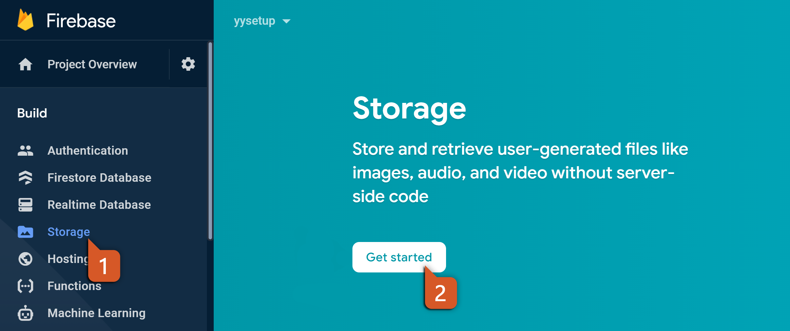
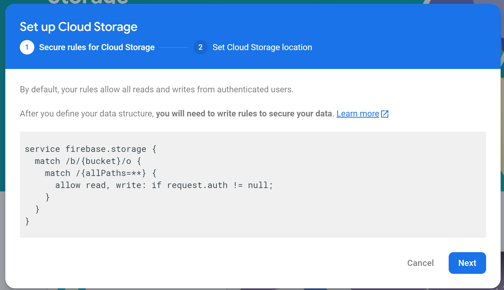
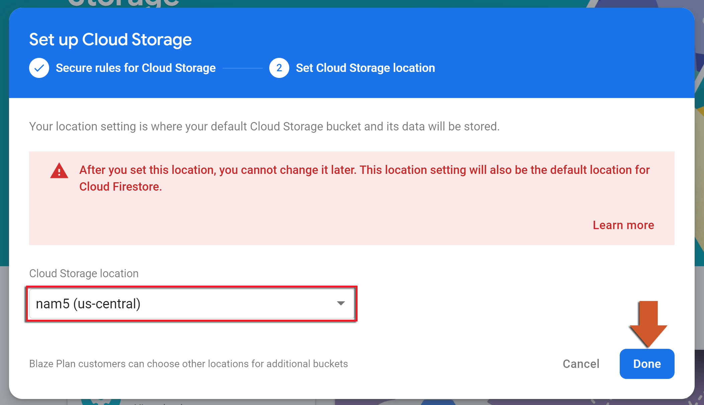
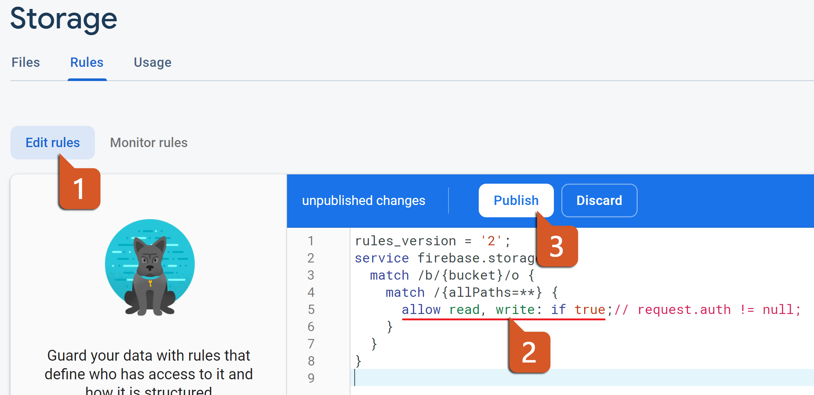

@title Cloud Storage Guide

# Cloud Storage Guide

This page is the console side of Cloud Storage: creating the bucket and writing the security rules
that decide who may upload and download what. The GML side is on the ${module.storage} page.

# Creating the bucket

1. In the [Firebase console](https://console.firebase.google.com/), open **Build > Storage** and
   click **Get started**. A new project has to be on the pay-as-you-go plan to create its bucket;
   the free tier still applies within it, and nothing is charged below it.<br>
   

2. The dialog shows the starting rules - reads and writes only for signed-in users. Click
   **Next**; the rules are edited afterwards.<br>
   

3. Choose the location - it cannot be changed later - and click **Done**.<br>
   

The bucket's name is in the credential files, so nothing in the game has to change; the **Files**
tab shows what the game uploads.

# Security rules

Every request from the game is checked against the rules under the **Rules** tab. The starting
rules require a signed-in player for everything, which is why a game that has not signed the
player in gets `Unauthenticated` (code `6`) on its first request: anonymous sign-in is enough
(see ${module.auth}). A request the rules refuse fails with `Unauthorized` (code `7`).<br>


The screenshot shows the editor with the wide-open rule `if true` some tutorials suggest; do not
ship it, since the game's code can be read out of the build and a bucket anyone may write to is
a bucket anyone may fill. The usual shape for a game gives each signed-in player a folder of
their own and makes shared content read-only:

```
rules_version = '2';
service firebase.storage {
  match /b/{bucket}/o {
    match /players/{uid}/{allPaths=**} {
      allow read, write: if request.auth != null && request.auth.uid == uid;
    }
    match /shared/{allPaths=**} {
      allow read: if request.auth != null;
      allow write: if false;
    }
  }
}
```

`request.auth.uid` is what ${function.firebase_auth_user_uid} returns, so the game builds its
paths from it. Rules can also limit what is uploaded - `request.resource.size < 5 * 1024 * 1024`
for a size cap, `request.resource.contentType.matches('image/.*')` for a type - which is the
only place such limits hold, since the client decides what it sends. Click **Publish** after
editing.

Listing a folder with ${function.firebase_storage_ref_list} needs rules written for
`rules_version = '2'`, as above; version 1 rules refuse every list request.
