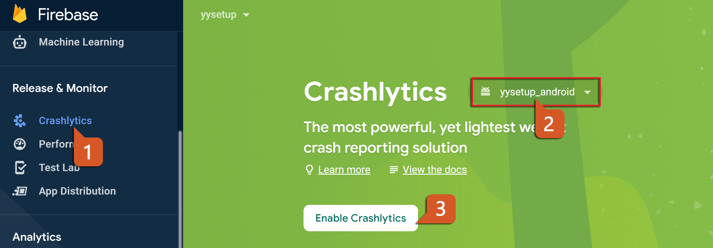
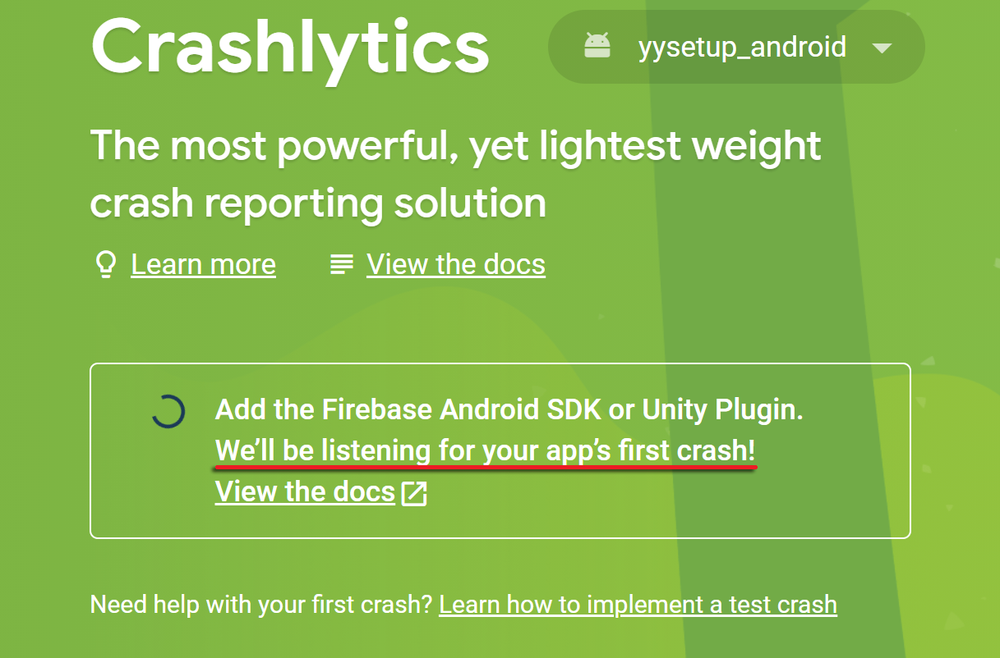
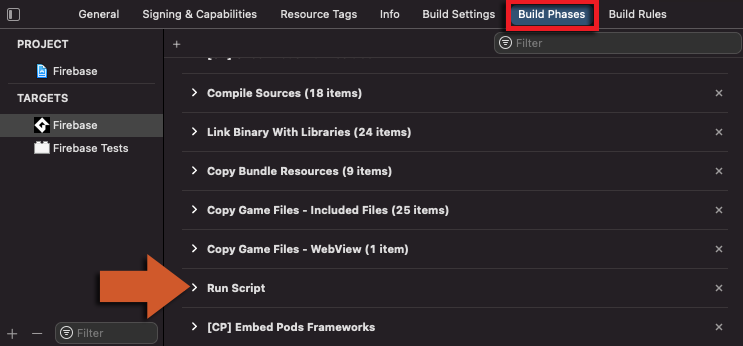
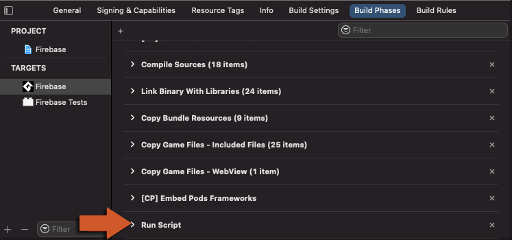

@title Crashlytics Guide

# Crashlytics Guide

This page is the console and build side of Crashlytics: enabling it, the first crash the console
waits for, and the Xcode step that gets iOS crash reports symbolicated. The GML side is on the
${module.crashlytics} page; Crashlytics is the `GMFirebaseCrashlytics` extension, imported
alongside GMFirebase and built for Android and iOS only.

# Enabling Crashlytics

1. In the [Firebase console](https://console.firebase.google.com/), open **Run > Crashlytics**,
   select the app and click **Enable Crashlytics**. 
   

2. The console now waits for the app's first crash report. Build the game with the extension in
   the project, run it on a device - not under the debugger, which on iOS keeps Crashlytics from
   recording the crash - and call ${function.firebase_crashlytics_test_crash}. The game closes;
   start it again, and the report is uploaded within a minute or two. 
   

3. The dashboard opens on the first report. From then on every crash of the game's process
   arrives the same way: recorded as it happens, uploaded at the next launch, grouped into
   issues with the device, the OS and whatever the game attached through the module.

# Building on iOS

Crash reports from iOS are only readable with the build's dSYM, and the extension adds an Xcode
run-script phase that uploads it after each build. Xcode runs build phases in the order listed,
and a script phase added to a project lands above the phases that produce what it uploads, so
once per exported Xcode project:

1. Build the project from GameMaker for the iOS target, so that the Xcode project exists, and
   open it in Xcode.
2. Select the game's target, open **Build Phases** and drag the **Run Script** item to the bottom
   of the list. 
   

3. With **Run Script** last, build and archive from Xcode as usual. 
   

A report from a build whose dSYM was not uploaded shows in the console with unsymbolicated
frames and a **Missing dSYMs** notice under the app's settings, which lists the UUIDs it needs;
the dSYM of an archived build can be uploaded by hand from there.

# Building on Android

Nothing to do: the extension adds the Crashlytics Gradle plugin, which uploads the mapping file
of a minified release build and, for native crashes, the symbols it finds in the build.
