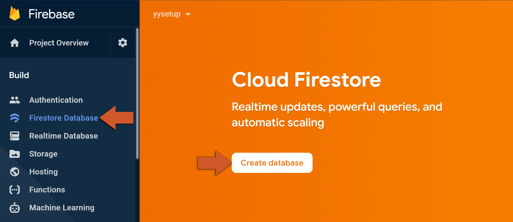
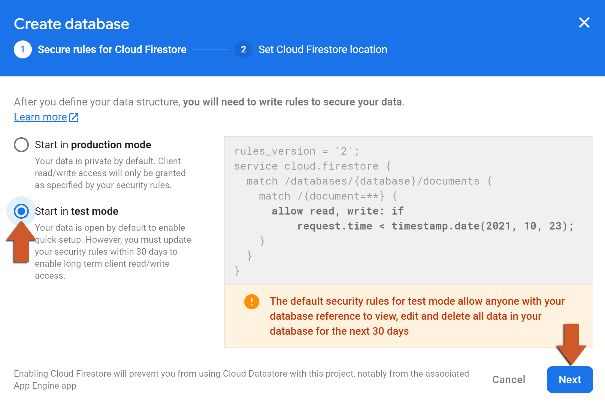
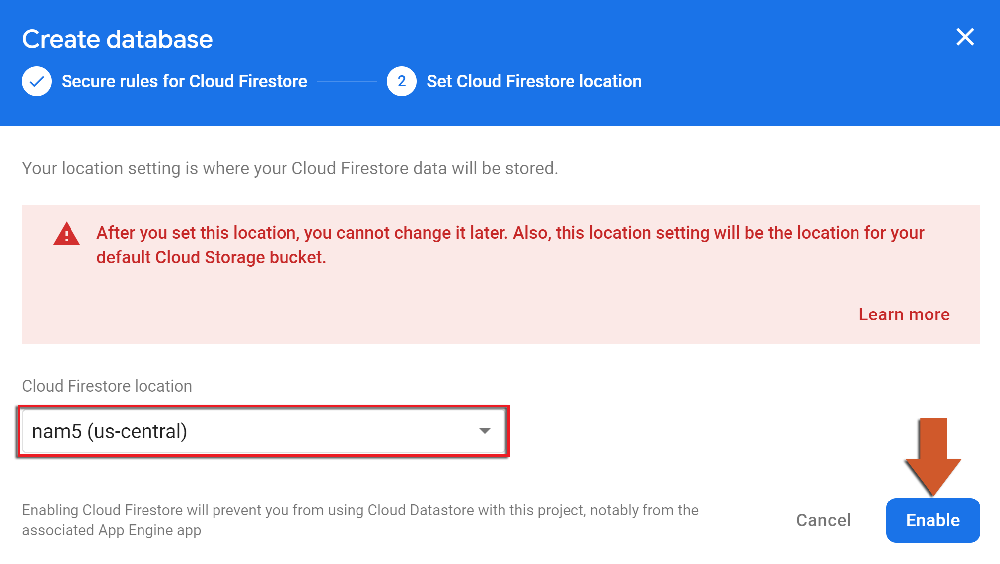

@title Cloud Firestore Guide

# Cloud Firestore Guide

This page is the console side of Cloud Firestore: creating the database, writing the security rules
that decide who may read and write what, and the indexes some queries need. The GML side is on the
${module.firestore} page.

# Creating the database

1. In the [Firebase console](https://console.firebase.google.com/), open **Build > Firestore
   Database** and click **Create database**.<br>
   

2. Choose the starting rules. **Test mode** lets anyone read and write for 30 days and then locks
   the database; **production mode** locks it from the start. Either way the rules get replaced by
   your own before release (see below); test mode just saves you writing them before you have
   tried the module out.<br>
   

3. Choose the location - it cannot be changed later, so pick the region closest to most of your
   players - and click **Enable**.<br>
   

The database is ready as soon as the console shows the empty **Data** tab; nothing in the game has
to change, the credential files already point at the project.

# Security rules

Every read and write from the game is checked against the rules under the **Rules** tab, and a
request the rules refuse fails in the game with `FirestoreError.PermissionDenied`. The rules are
the only thing standing between the internet and your data: the game's code can be read out of the
build, so a rule that allows everything is a database anyone can edit. The usual shape for a game
gives each signed-in player their own document and nothing else:

```
rules_version = '2';
service cloud.firestore {
  match /databases/{database}/documents {
    match /players/{uid} {
      allow read, write: if request.auth != null && request.auth.uid == uid;
    }
    match /leaderboard/{entry} {
      allow read: if true;
      allow write: if false;
    }
  }
}
```

`request.auth` is the player's Firebase Authentication sign-in - anonymous sign-in is enough to get
one (see ${module.auth}) - and `request.auth.uid` is what ${function.firebase_auth_user_uid}
returns, so a game keys its per-player documents by it. Data that every player may read but none
may write, such as a leaderboard, is written by a Cloud Function (${module.functions}) instead,
which is not subject to the rules. Click **Publish** after editing; the change applies within a
minute. The **Rules playground** on the same tab lets you try a request against the rules without
running the game.

# Indexes

A query on one field uses the automatic indexes. A query that filters or orders on several fields
needs a composite index, and the first run of such a query fails with
`FirestoreError.FailedPrecondition` and an error message that carries a link: open it and the
console creates the exact index the query needs. Indexes take a few minutes to build; the query
works once **Indexes** shows it as enabled.
