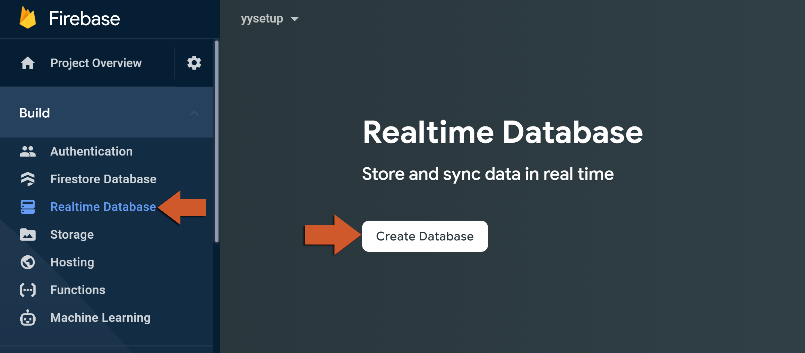
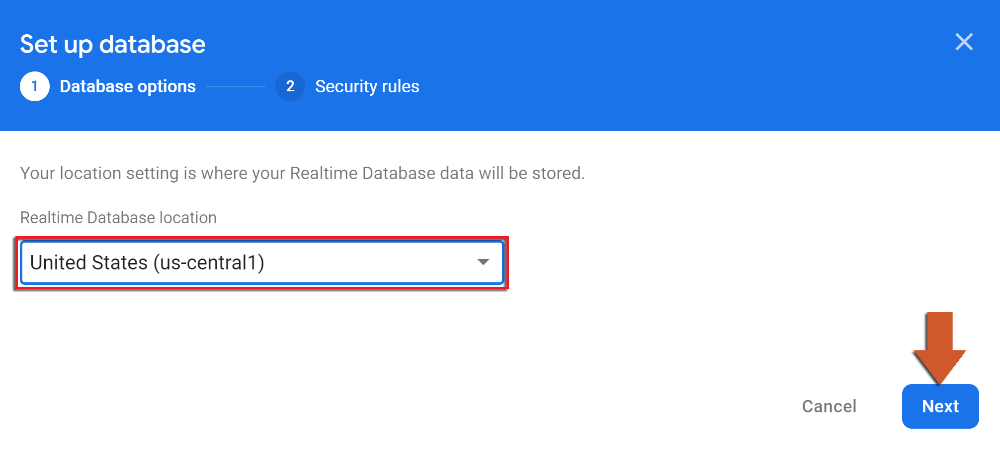
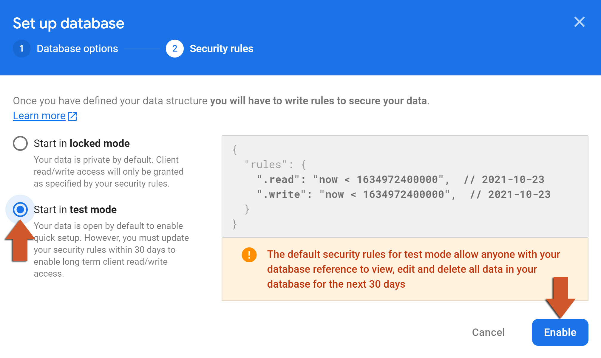

@title Realtime Database Guide

# Realtime Database Guide

This page is the console side of the Realtime Database: creating the database, pointing the game at
it, and writing its security rules. The GML side is on the ${module.database} page.

# Creating the database

1. In the [Firebase console](https://console.firebase.google.com/), open **Build > Realtime
   Database** and click **Create Database**.<br>
   

2. Choose the location. It becomes part of the database URL and cannot be changed later, so pick
   the region closest to most of your players.<br>
   

3. Choose the starting rules. **Test mode** lets anyone read and write for 30 days and then locks
   the database; **locked mode** refuses everything from the start. Either way the rules get
   replaced by your own before release (see below).<br>
   

# The database URL

The SDK finds the database through its URL, which is in the credential files only if they were
downloaded after the database was created. If you registered the app first, download
`google-services.json` and `GoogleService-Info.plist` again from **Project settings > Your apps**
and replace the files the extension options point at (${page.extension_options}); a build with the
old files fails at the first request with a message about a missing database URL. The URL is shown
at the top of the **Data** tab - a game that uses more than one database, or wants to be explicit,
passes it to ${function.firebase_database_get_instance_for_url} instead.

# Security rules

Every read and write from the game is checked against the rules under the **Rules** tab, and a
request the rules refuse fails in the game with `FirebaseDatabaseError.PermissionDenied`. The rules
are the only thing between the internet and your data - the game's code can be read out of the
build - so a rule that allows everything is a database anyone can edit. The usual shape for a game
gives each signed-in player their own subtree:

```
{
  "rules": {
    "players": {
      "$uid": {
        ".read": "auth != null && auth.uid == $uid",
        ".write": "auth != null && auth.uid == $uid"
      }
    },
    "leaderboard": {
      ".read": true,
      ".write": false
    }
  }
}
```

`auth` is the player's Firebase Authentication sign-in - anonymous sign-in is enough to get one
(see ${module.auth}) - and `auth.uid` is what ${function.firebase_auth_user_uid} returns, so a game
keys its per-player data by it. Data every player may read but none may write, such as a
leaderboard, is written by a Cloud Function (${module.functions}), which the rules do not apply to.
Click **Publish** after editing; the change applies at once. The **Rules playground** on the same
tab lets you try a read or write against the rules without running the game.

A rule at one level grants access to everything below it, and `.read`/`.write` on a parent cannot
be taken back by a child; `.validate` rules are the place to constrain what a write may contain
(a score that must be a number, a name no longer than 20 characters).
