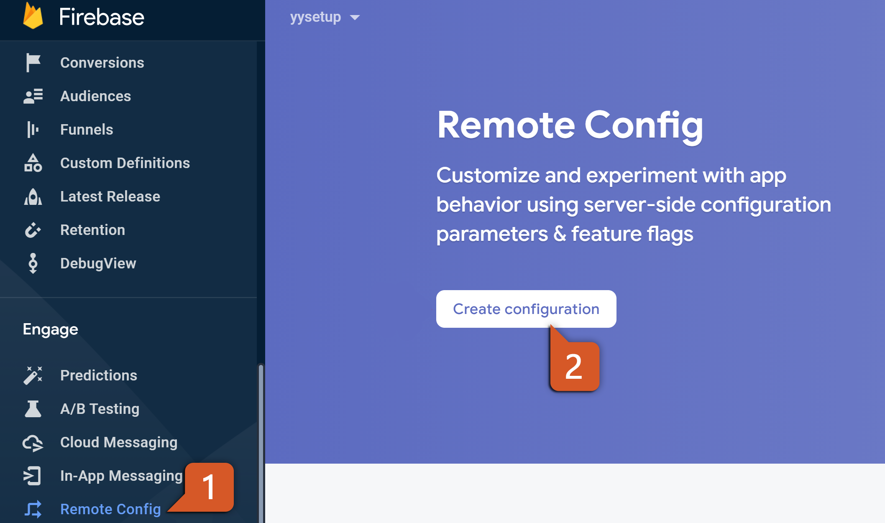
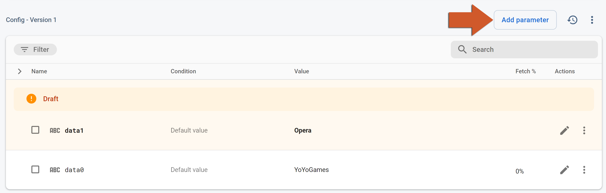
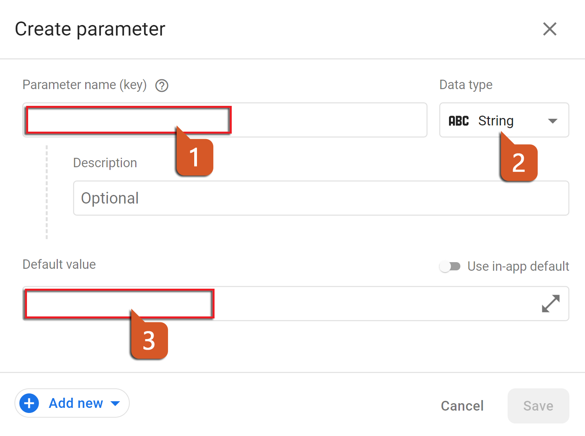
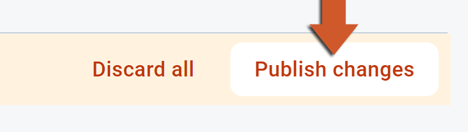

@title Remote Config Guide

# Remote Config Guide

This page is the console side of Remote Config: creating parameters, giving them different values
for different players, and publishing. The GML side - defaults, fetching, activating, reading - is
on the ${module.remote_config} page.

# Creating parameters

1. In the [Firebase console](https://console.firebase.google.com/), open **Run > Remote Config**
   and click **Create configuration**. 
   

2. Click **Add parameter**. 
   

3. Enter the **Parameter name** - the key the game reads, e.g. `enemy_speed` - choose its data
   type and enter the **Default value**, then click **Save**. The type is what the console
   validates; the game reads every value through the typed getter it wants, and a value that does
   not convert reads as the type's static value (`0`, `false`, an empty string). 
   

4. When the parameters are in, click **Publish changes**. Nothing reaches any game until it is
   published, and a published change reaches a game at its next fetch - within the minimum fetch
   interval a fetch returns the stored values without asking the backend, so during development
   bring the interval to `0` with ${function.firebase_remote_config_set_config_settings}. 
   

Give the game the same keys with the same default values through
${function.firebase_remote_config_set_defaults}: the console's defaults apply to the values it
serves, the game's to the frames before the first fetch has been activated and to a game that
never gets one.

# Conditions

A parameter can take a different value for players who match a condition. Under **Conditions**,
create one from the targets the console offers - app, platform, app version, country, language,
Analytics user property, Analytics audience, a random percentage of players, the first-open time -
and then, on the parameter, click **Add new** next to the default value to give the condition its
own value. The order of the conditions is their priority: the first that matches wins.

The game's own state is targetable through **Custom signals**: key-value pairs the game sets with
${function.firebase_remote_config_set_custom_signals} (the player's level, the difficulty, whether
they have paid) and the console matches with a condition on the signal's key. A signal has to be
set before the fetch that should honour it.

# Rollouts and experiments

A change to a parameter can be rolled out to a growing percentage of players, and an A/B test
(under **Run > A/B Testing**) can serve two values to two groups and compare an Analytics metric
between them; both are built on the same conditions and need Analytics collecting. The **Change
history** of the configuration lists every published version and lets you roll back to one.
