@title Platform Setup

# Platform Setup

Each platform you ship on has to be registered with your Firebase project once, and the console
gives you a credential file for it that the extension stages into the build. This page covers that
registration; where the files go afterwards is on ${page.extension_options}.

[[Note: Desktop builds need no registration of their own. Windows, macOS and Linux use the Android
app's `google-services.json` through the same **google-services.json** option, so register an
Android app even if you only ship on desktop.]]

# Android

This is done once per project and gives you the `google-services.json` for the **google-services
(json)** option. For the Android project itself, see the
[GameMaker helpdesk article](https://help.gamemaker.io/hc/en-us/articles/115001368727-Setting-Up-For-Android).

1. In the [Firebase console](https://console.firebase.google.com/), click the **Settings** icon next
   to **Project Overview** and select **Project settings**. 
   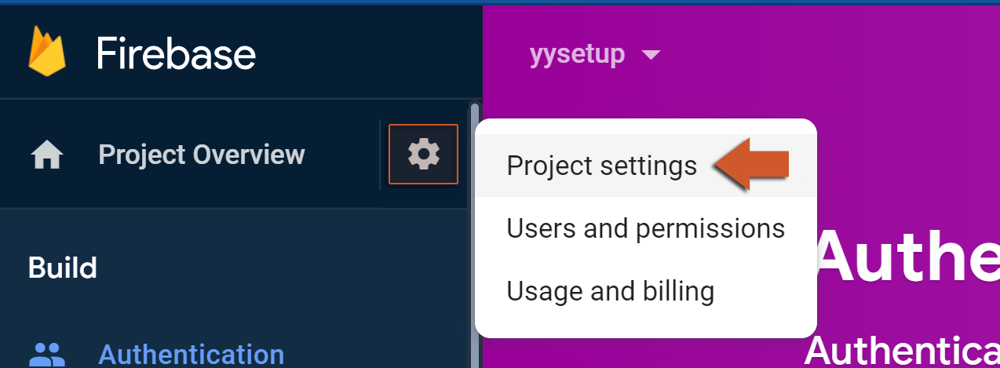

2. In the **Your apps** section, click the **Android** button. 
   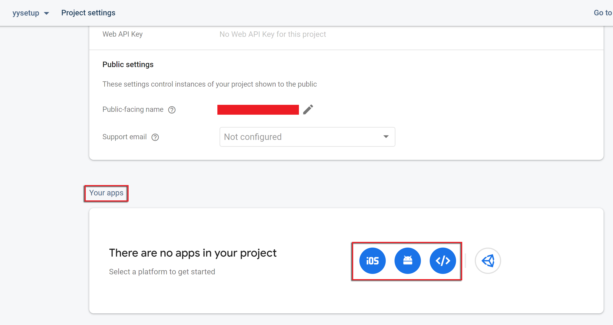

3. Enter your **Package name** (required), an **App nickname** (optional) and, if you use Firebase
   Authentication, the **Debug signing certificate SHA-1** (required for it). 
   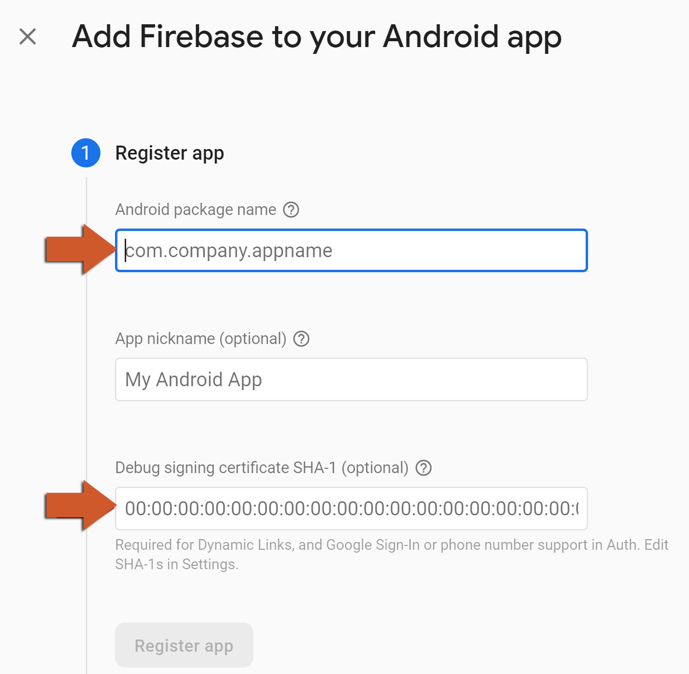

   The package name is the one in your
   [Android Game Options](https://manual.gamemaker.io/monthly/en/#t=Settings%2FGame_Options%2FAndroid.htm);
   the SHA-1 is shown in the
   [Android Preferences](https://manual.gamemaker.io/monthly/en/#t=Setting_Up_And_Version_Information%2FPlatform_Preferences%2FAndroid.htm)
   under **Keystore**: 
   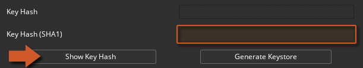

4. Click **Download google-services.json** and keep the file - it is what the extension option
   points at. 
   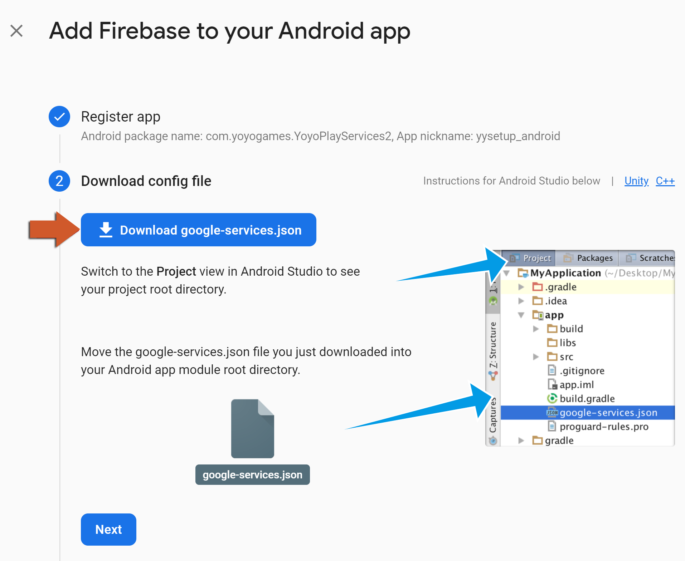

5. Skip the "Add Firebase SDK" step; the extension already adds the dependencies to the Android
   build. 
   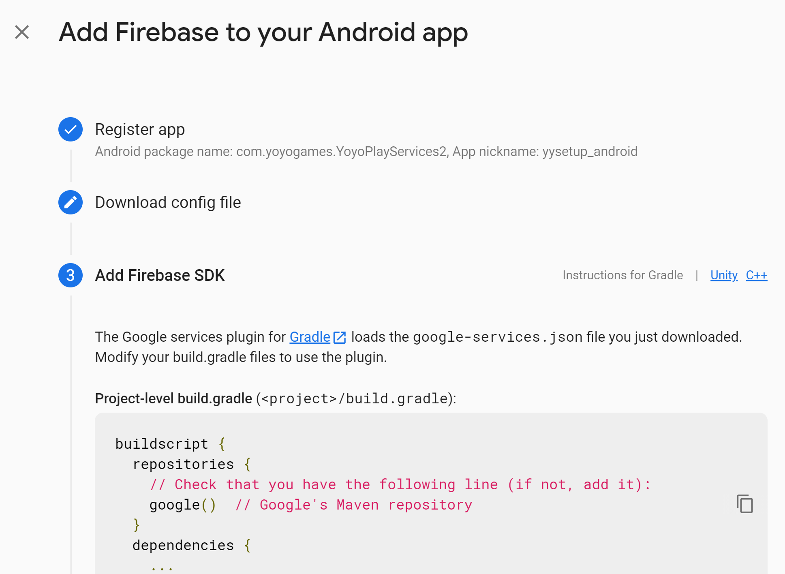

6. Click **Continue to console**. 
   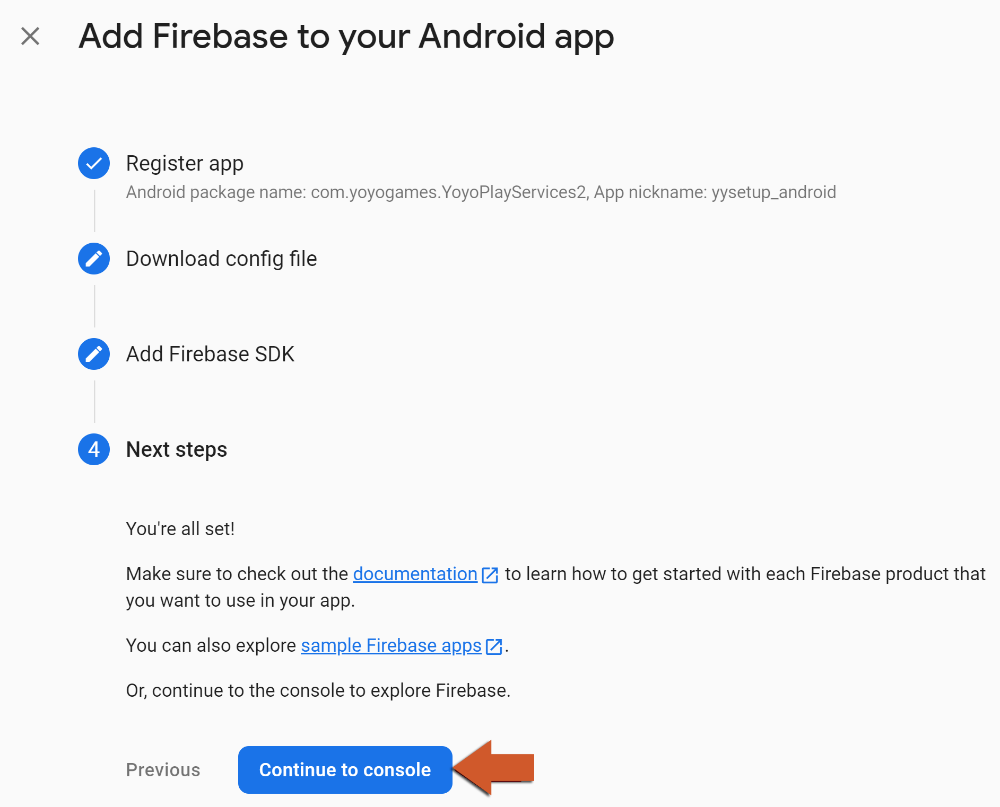

7. Put the file in a folder outside the project (the option's default is `../Firebase_private/`)
   and point **google-services.json** at it.

A release build signed with a different keystore needs that keystore's SHA-1 added to the app in the
console too, or Firebase Authentication rejects it.

# iOS

This is done once per project and gives you the `GoogleService-Info.plist` for the
**GoogleService-Info.plist** option. For the iOS project itself, see the
[GameMaker helpdesk article](https://help.gamemaker.io/hc/en-us/articles/115001368747-Setting-Up-For-iOS-Including-iPadOS).

1. In the [Firebase console](https://console.firebase.google.com/), click the **Settings** icon next
   to **Project Overview** and select **Project settings**. 
   

2. In the **Your apps** section, click the **iOS** button. 
   

3. Enter your **iOS Bundle ID** - the one in your iOS Game Options - and, optionally, an **App
   nickname** and the **App Store ID**. 
   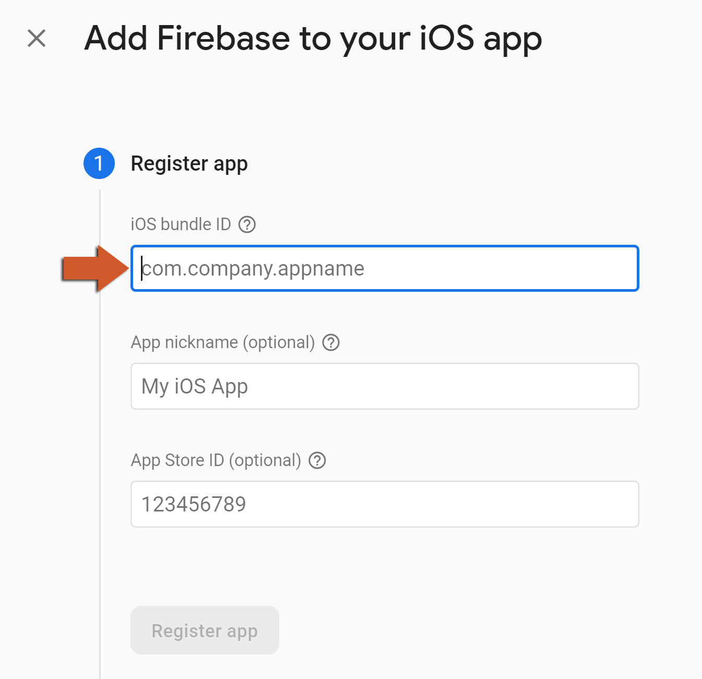

4. Click **Download GoogleService-Info.plist** and keep the file. 
   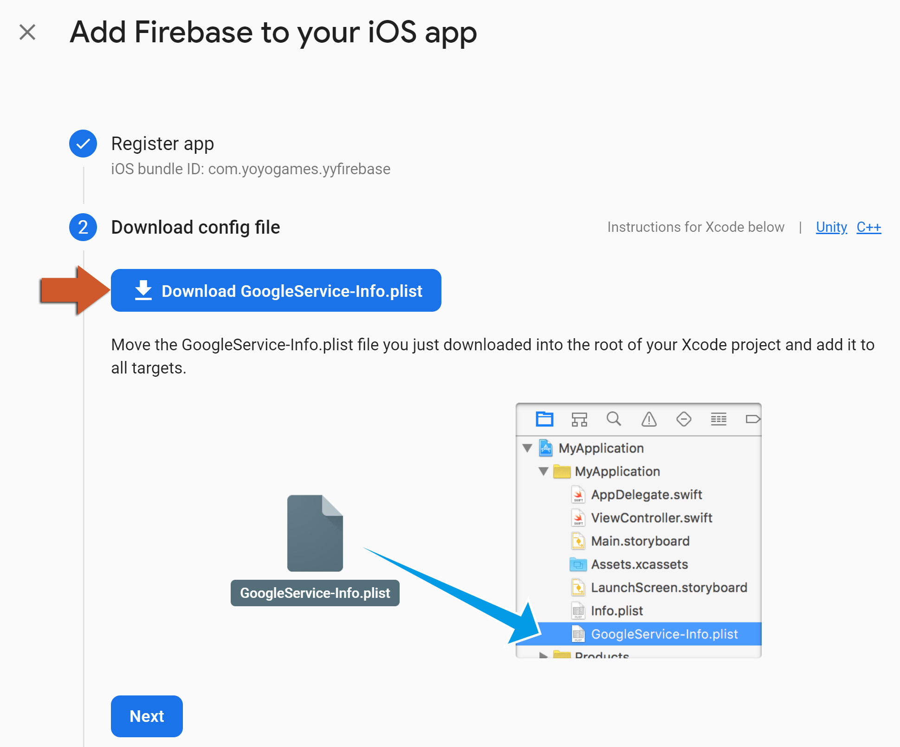

5. Skip the "Add Firebase SDK" and "Add initialization code" steps; the extension declares the pods
   and initialises the SDK itself. 
   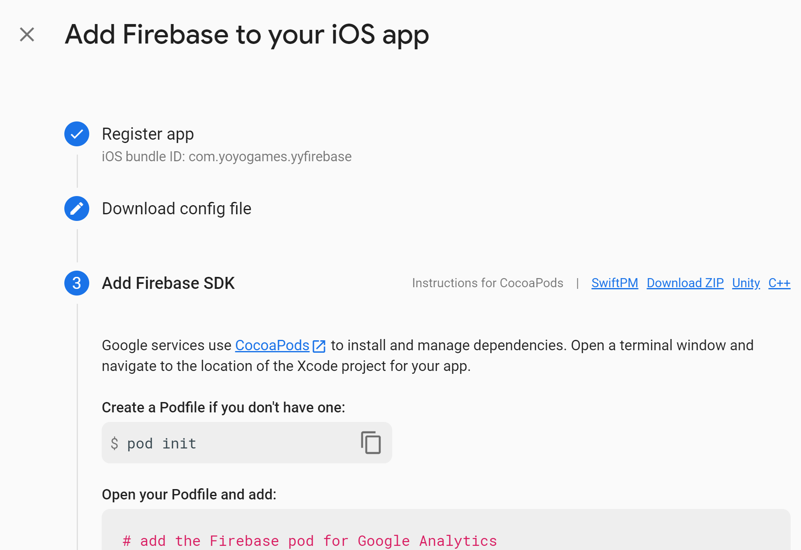
   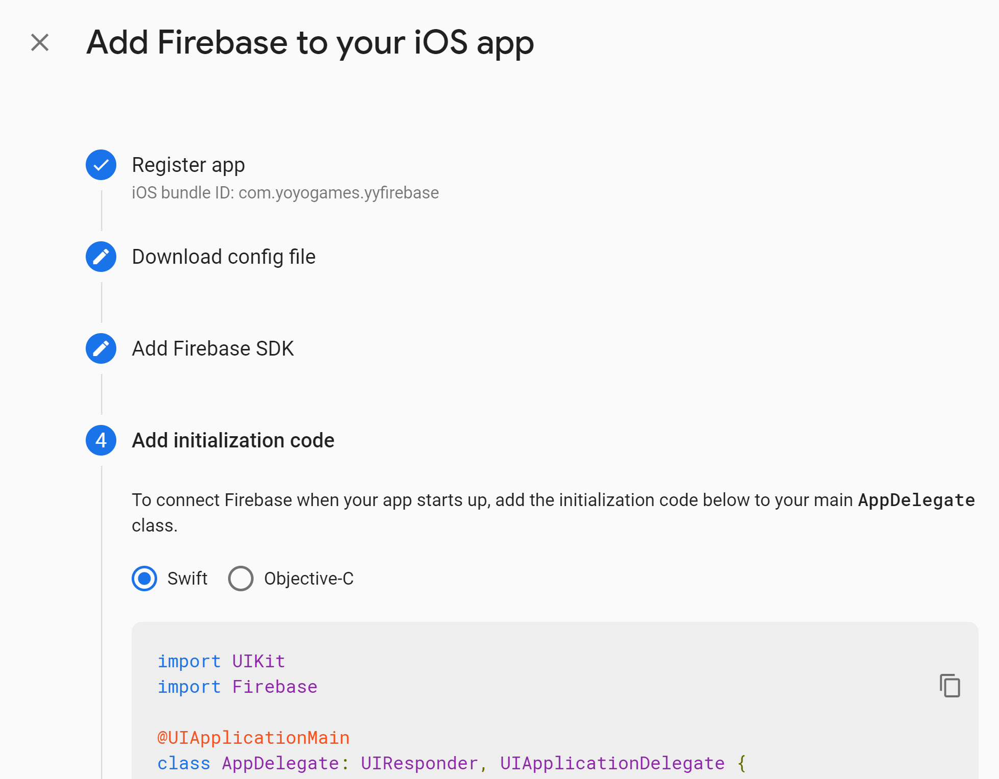

6. Click **Continue to console**. 
   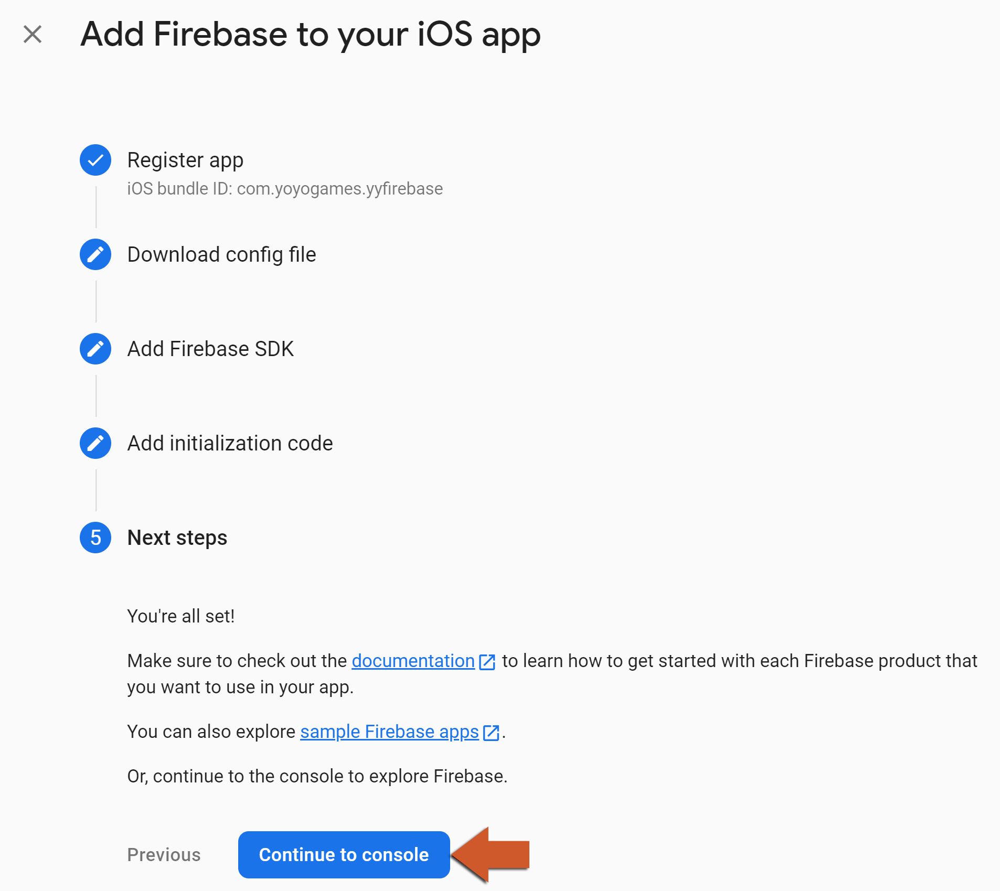

7. Put the file outside the project (the option's default is `../Firebase_private/`) and point
   **GoogleService-Info.plist** at it.

8. The Firebase pods are pulled in through CocoaPods, so the Mac that builds the game needs it set up
   as described in the
   [CocoaPods helpdesk article](https://help.gamemaker.io/hc/en-us/articles/360008958858-iOS-and-tvOS-Using-CocoaPods),
   and the game's minimum iOS version in the iOS Game Options must be **15.0** or higher.

# Cloud Messaging on iOS

Push notifications on iOS additionally need an APNs authentication key uploaded to the Firebase
project (**Project settings** > **Cloud Messaging** > **Apple app configuration**) and the Push
Notifications capability on your App ID. The ${module.messaging} page has the details.
