@title Cloud Functions Setup

# Cloud Functions Setup

Cloud Functions have little to do with GML: they are server-side code, written in JavaScript,
TypeScript or Python and deployed to Firebase with its command-line tools, that the game calls
through the ${module.functions} module. This page gets a first **callable** function written,
deployed and called; the module page has the calling side in full.

# Enabling Cloud Functions

1. In the [Firebase console](https://console.firebase.google.com/), open **Build > Functions**.
   Functions need the project on the pay-as-you-go (Blaze) plan; click **Upgrade project** if it
   is not. The plan has a free tier that a small game's functions stay within, and a budget alert
   can be set on it.<br>
   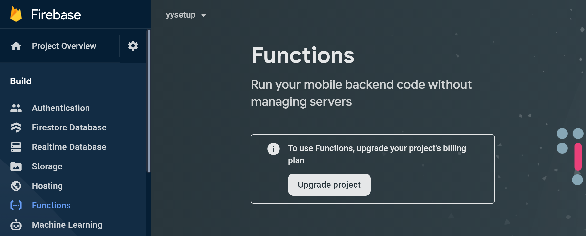

2. Once upgraded, the page waits for a first deploy; click **Instructions**.<br>
   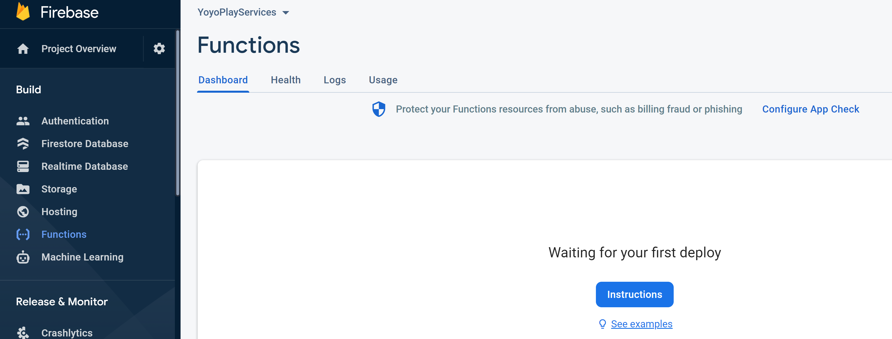

3. The first instruction is to install the Firebase command-line tools with
   `npm install -g firebase-tools`, which needs [Node.js](https://nodejs.org/) on your machine.<br>
   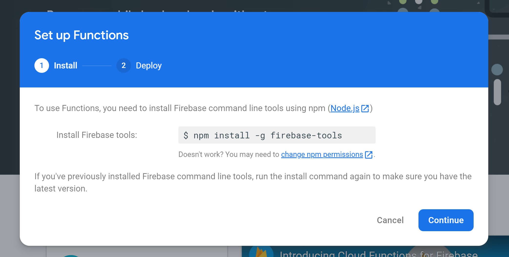

4. Click **Continue** and leave the console; the rest happens on your machine.<br>
   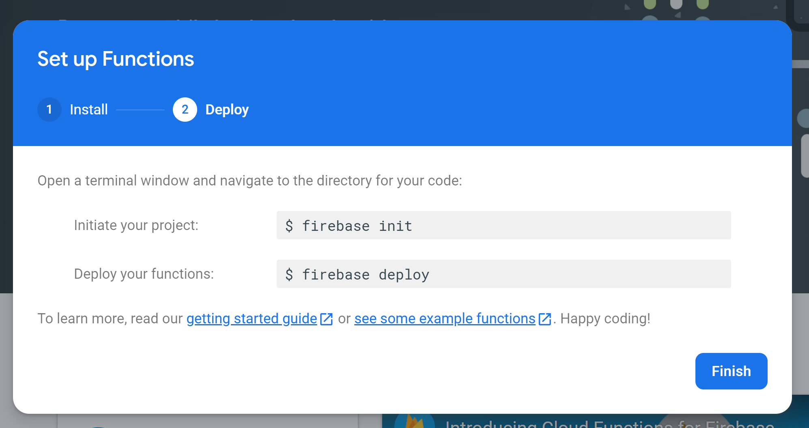

# Creating the project folder

1. Open a terminal in the folder that will hold the functions (not inside the GameMaker project)
   and sign in once with `firebase login`.<br>
   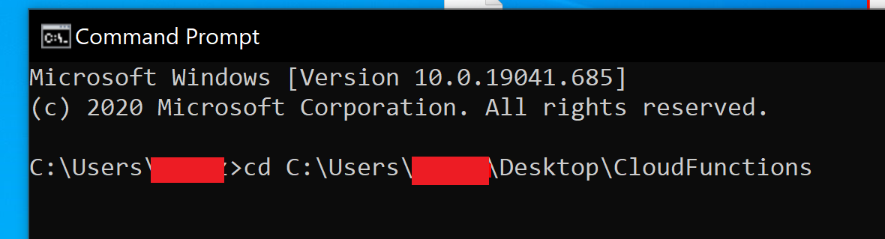

2. Run `firebase init`.<br>
   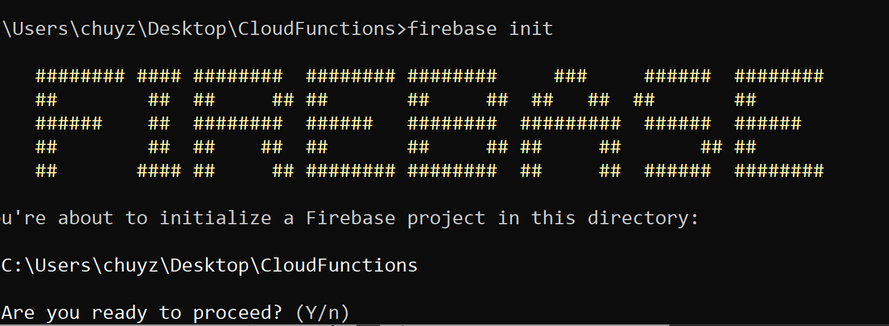

3. Answer **Y** to "Are you ready to proceed?", then select **Functions** with the space bar and
   press Enter.<br>
   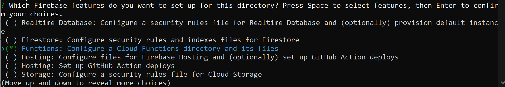

4. Choose **Use an existing project** and pick your Firebase project from the list (its ID is the
   one shown under **Project settings** in the console).<br>
   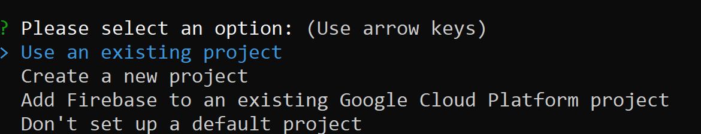
   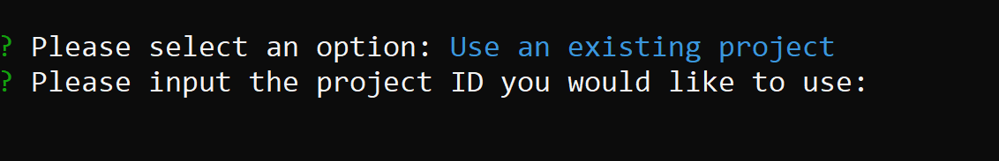

5. Choose **JavaScript** as the language, whether to use ESLint (**N** is fine to start), and
   **Y** to install the dependencies.<br>
   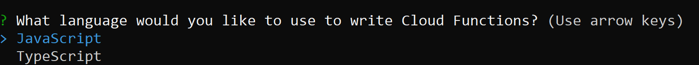
   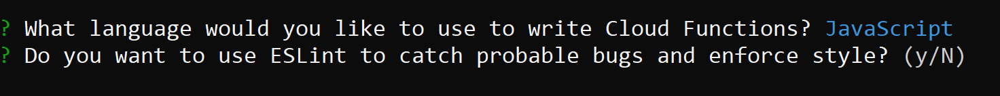
   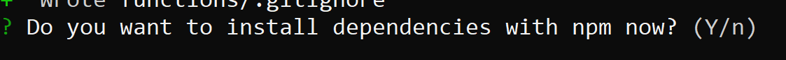

6. The folder now holds a `functions` folder with an `index.js`, which is where the functions are
   declared.<br>
   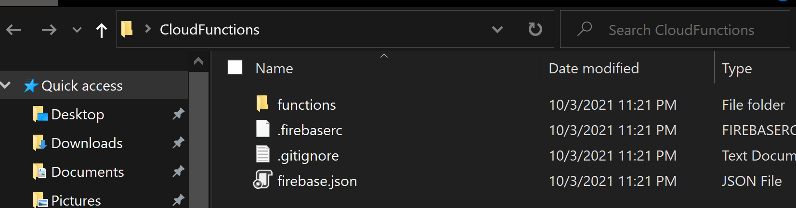
   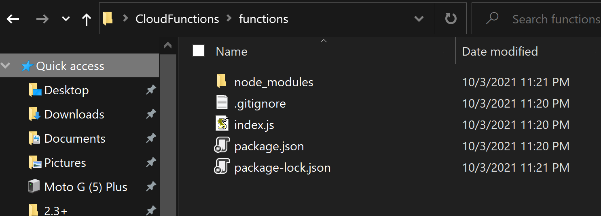

# Writing a callable function

The module calls **callable** functions: a function declared with `onCall`, which receives the
value the game sent as `request.data` and returns the value the game gets back. Replace the
contents of `index.js` with:

```
const { onCall, HttpsError } = require("firebase-functions/v2/https");

exports.claimDailyReward = onCall((request) => {
  if (!request.auth) {
    throw new HttpsError("unauthenticated", "Sign in to claim a reward.");
  }
  const day = request.data.day;
  if (typeof day !== "number") {
    throw new HttpsError("invalid-argument", "day must be a number.");
  }
  // ... check the player's record, grant the reward ...
  return { coins: 100, day: day };
});
```

`request.data` is the struct the game passes to
${function.firebase_functions_callable_call_with_data}, as JSON; the returned object arrives in
the game's callback as a struct; `request.auth` is the signed-in player (their `uid` is
`request.auth.uid`), so a function can trust who is calling without the game sending anything.
An `HttpsError` reaches the game as the matching error code - `unauthenticated` is `16`,
`invalid-argument` is `3` - with the message; anything else thrown arrives as `Internal` (`13`).
Functions deploy to `us-central1` unless the code says otherwise, and the game's
${function.firebase_functions_get_instance} addresses that region; a function deployed elsewhere
is reached through ${function.firebase_functions_get_instance_with_region}.

# Deploying

1. Run `firebase deploy --only functions` from the folder. The first deploy of a project takes a
   few minutes; it ends with **Deploy complete**.<br>
   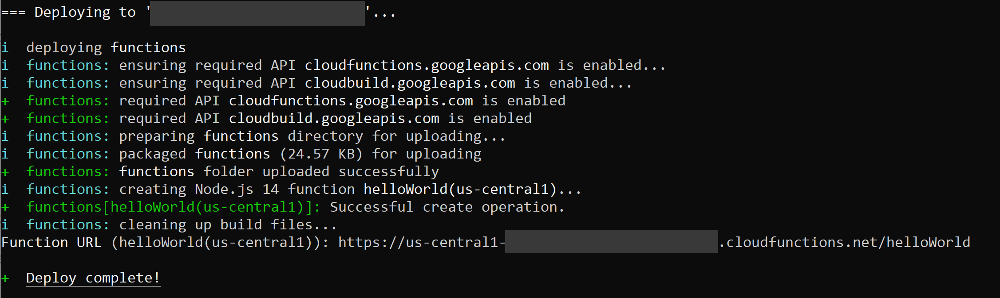

2. The function is now listed under **Build > Functions** in the console, with its region and
   trigger, and its **Logs** tab shows every call, including the `console.log` output of the
   function itself.<br>
   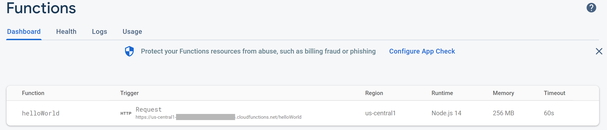

3. In the game, get the callable by the exported name and call it - the example on
   ${function.firebase_functions_get_https_callable} is this very function.

To iterate without deploying, the Firebase Local Emulator Suite (`firebase emulators:start`) runs
the functions on your machine, and ${function.firebase_functions_use_functions_emulator} points
the game at it.
